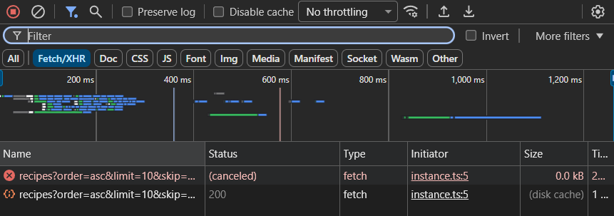
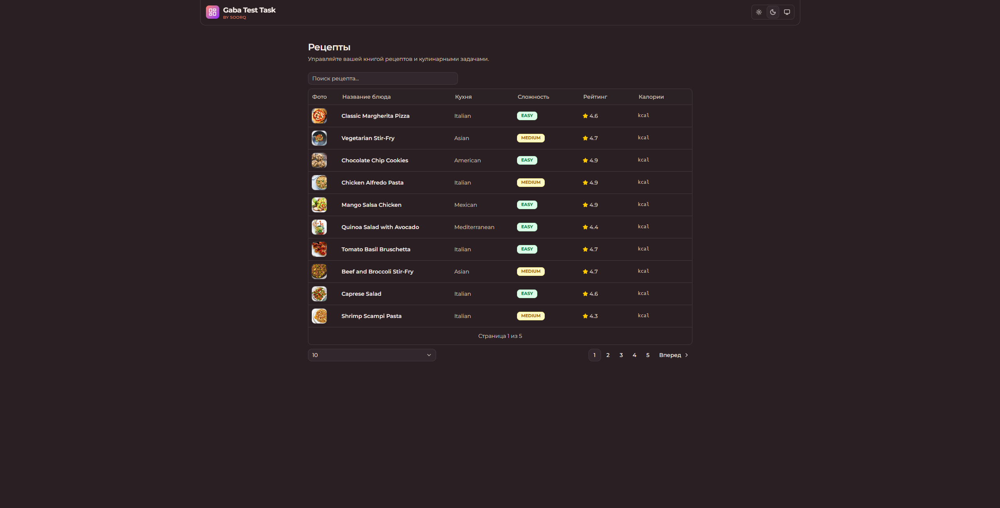
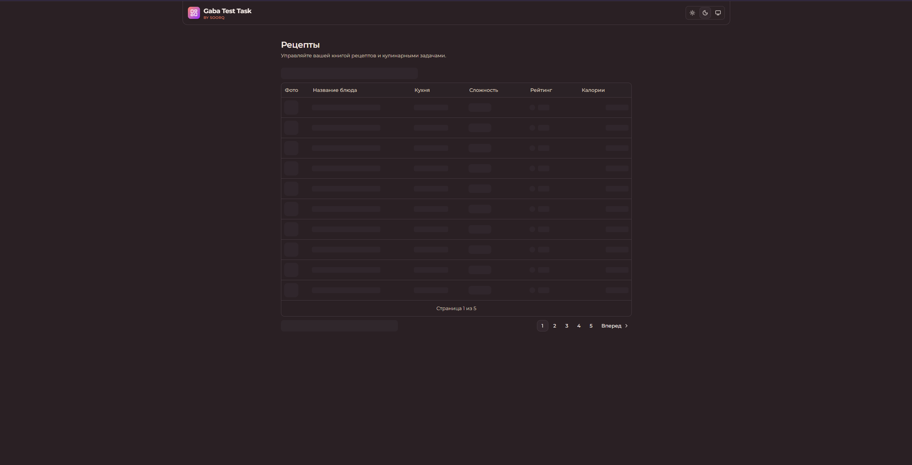
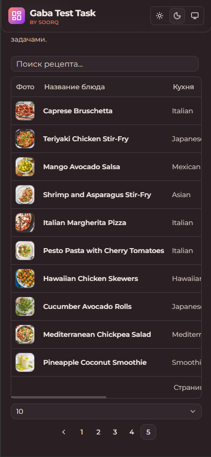
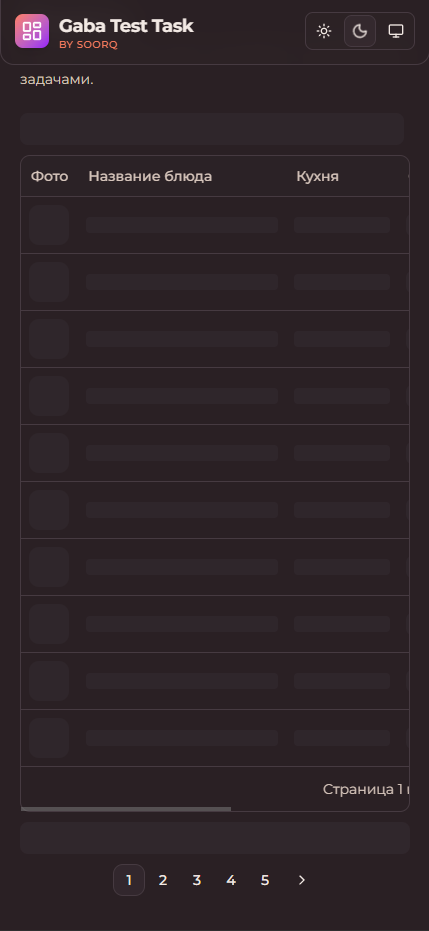
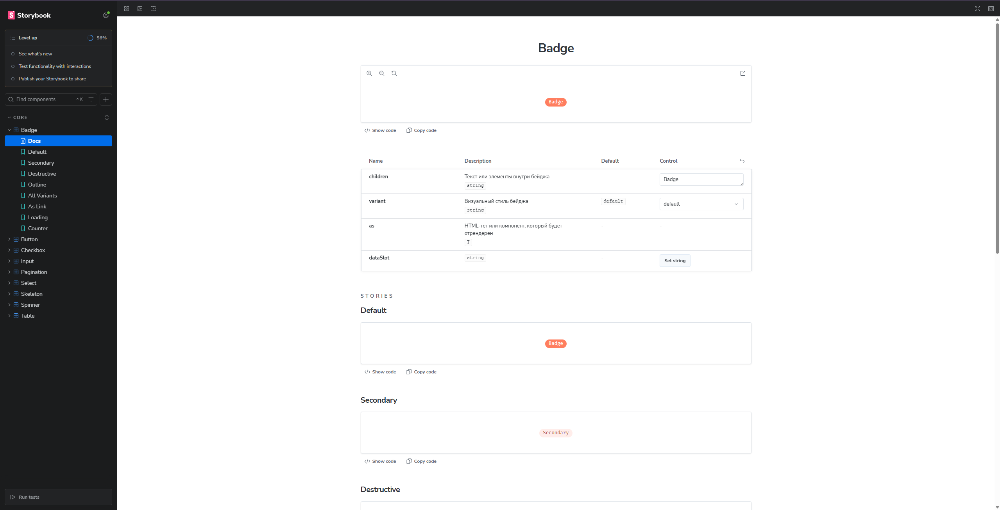
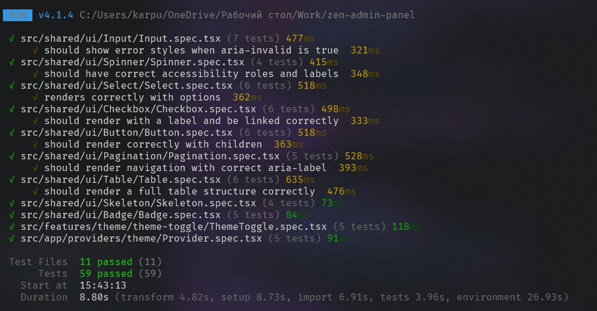

# Interactive demo table

Для обеспечения консистентности данных и отзывчивости интерфейса реализованы следующие механизмы:

### 1. Request Cancellation

В хуке `useRecipes` реализован жизненный цикл запроса с использованием `AbortController`.

- **Механизм:** При каждом обновлении зависимостей (фильтров) вызывается `abort()` для текущего промиса.
- **Результат:** Это гарантирует, что "запоздавший" ответ от предыдущего набора фильтров не перезапишет актуальное состояние (решение проблемы Race Condition).

### 2. Дебаунсинг и нормализация параметров

- **Search Debounce:** Поисковый запрос проходит через `useDebounceValue` (500ms), предотвращая каскад сетевых вызовов при каждом нажатии клавиши.
- **State Sync:** В `useTableParams` настроен автоматический сброс `page: 1` при изменении сортировки или лимита, что исключает некорректные состояния пагинации.

### 3. Слой сервиса и кэширование

`ProjectsService` инкапсулирует логику работы с данными:

- **Deterministic Key Serialization:** Хэширование параметров запроса с предварительной сортировкой ключей объекта. Это гарантирует попадание в кэш независимо от порядка свойств в объекте параметров.
- **TTL Caching:** Реализовано InMemory-кэширование со `STALE_TIME` (5 минут), что минимизирует количество запросов при навигации назад/вперед по страницам.

### 4. Оптимизация рендеринга и управления состоянием

- **Request Race Condition Handling:** Использование `AbortController` внутри `useEffect`. При изменении любого параметра фильтрации (search, page, sort) срабатывает cleanup-функция, которая отменяет предыдущий fetch. Это гарантирует, что стейт обновят только данные от последнего инициализированного запроса.
- **Separation of Concerns:** \* `useEffect` выступает реактивным триггером, завязанным на атомарные поля `params`.
    - `useEffectEvent` (onFetchEvent) используется для инкапсуляции вызова `executer`. Хотя в текущем виде `executer` находится в замыкании хука, использование `useEffectEvent` подготавливает почву для декуплизации логики запроса от реактивного цикла рендеринга.
- **Imperative Escape Hatch:** Реализован метод `refetch`, который позволяет вручную перезапустить цепочку запроса (например, при ошибке), используя ту же логику отмены через `abortRef`, что и автоматические эффекты.

## Тестирование и Storybook

В проекте настроены инструменты контроля качества, однако есть ограничения по времени реализации:

- **Vitest:** Реализовано Unit-тестирование для компонентов из слоя **Shared UI**.
- **Storybook:** Подключен для изолированной разработки и документирования UI-компонентов.
- **⚠️ Ограничение:** Интеграция тестов со Storybook (Interaction Testing / Play functions) на данный момент **не реализована**. Тестирование и Storybook существуют как два независимых слоя.

## Инструкция по запуску

**Важно:** Скопируйте `.env.example` в `.env` и убедитесь, что `VITE_API_URL` настроен верно.

### Разработка и сборка

- `pnpm run start:dev` — запуск приложения в режиме разработки (Vite).
- `pnpm run build` — проверка типов (TSC) и сборка проекта.
- `pnpm run start:prod` — запуск превью собранного билда.

### Тестирование (Vitest)

- `pnpm run test` — разовый запуск тестов.
- `pnpm run test:watch` — запуск тестов в режиме наблюдателя.
- `pnpm run test:ui` — графический интерфейс для визуализации тестов.
- `pnpm run test:coverage` — генерация отчета о покрытии кода.

### Документация компонентов (Storybook)

- `pnpm run start:book` — запуск Storybook на порту 6006.
- `pnpm run build:book` — статическая сборка сторибука.

## Скриншоты и демонстрация

Для подтверждения корректности работы реализованных механизмов ниже представлены ключевые состояния системы:

### 1. Обработка Race Conditions (Network)

На данном скриншоте видна работа `AbortController` при интенсивном изменении фильтров. Предыдущие запросы переходят в статус `canceled`, не блокируя поток данных и не вызывая несоответствия стейта.

### 2. Основной интерфейс

<table width="100%">
  <tr>
    <td width="25%" align="center">
      
       Desktop: Ready
    </td>
    <td width="25%" align="center">
      
       Desktop: Loading
    </td>
    <td width="25%" align="center">
      
       Mobile: Ready
    </td>
    <td width="25%" align="center">
      
       Mobile: Loading
    </td>
  </tr>
</table>

### 3. Storybook (Shared UI)

Документация и изолированная среда разработки для компонентов верхнего уровня.

### 4. Unit-тестирование

Результаты выполнения тестов в среде Vitest для слоя Shared UI.

